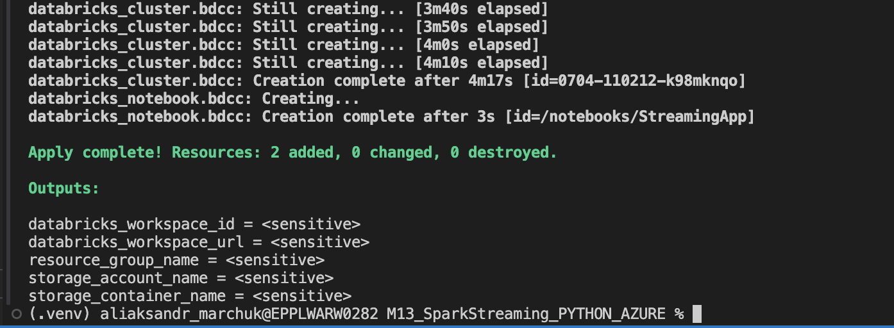
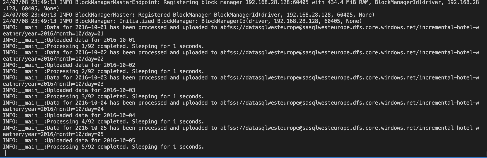
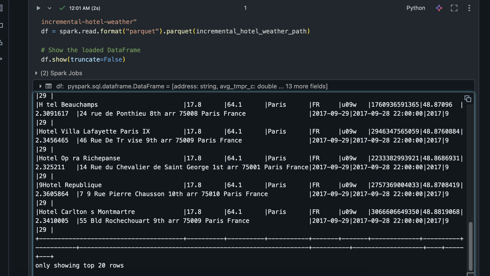
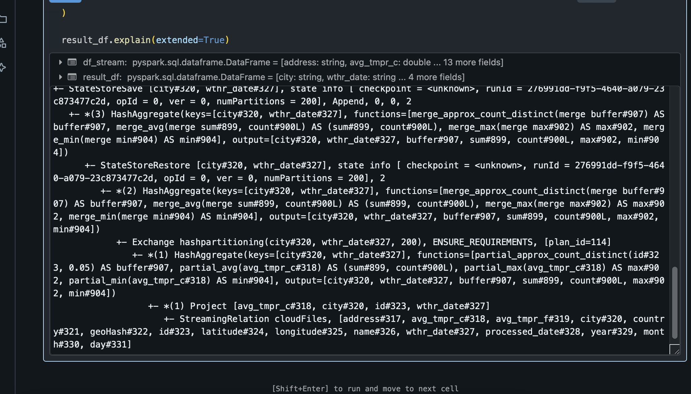
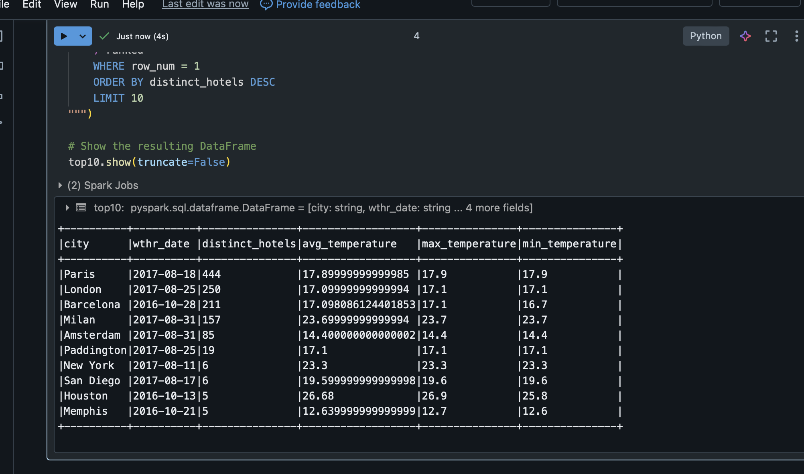
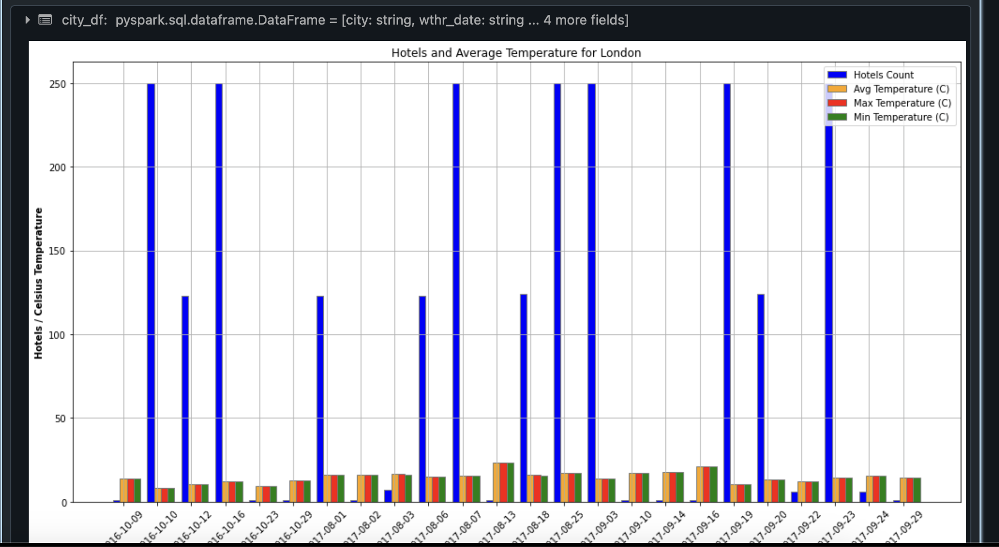

# Spark Streaming

Link to project repo - https://github.com/Mamba369x/M13_SparkStreaming_PYTHON_AZURE/tree/main

## Prerequisites

- Azure CLI
- Terraform
- Python 3
- wget (for Linux/Mac)
- Make
- Jq

## Environment Variables

Before running the Makefile targets, ensure that the following environment variables are set:

- `TF_VAR_SUBSCRIPTION_ID`: Your Azure subscription ID

### Setting Environment Variables

#### On Mac and Linux

To set the environment variables on Mac or Linux, you can use the `export` command in the terminal:

```bash
export TF_VAR_SUBSCRIPTION_ID=<your_subscription_id>
```

## Example Usage

* Step 1: First step involes creating terraform infrastructure and databricks cluster

```bash
make start
```



* Step 2: Upload incremental copy with configurable CYCLES_DELAY_TIME equaling 1 second by default

```bash
make upload
```



* Step 3: Naviate to azure databricks workspace, launch notebook stream.ipynb and observe results






